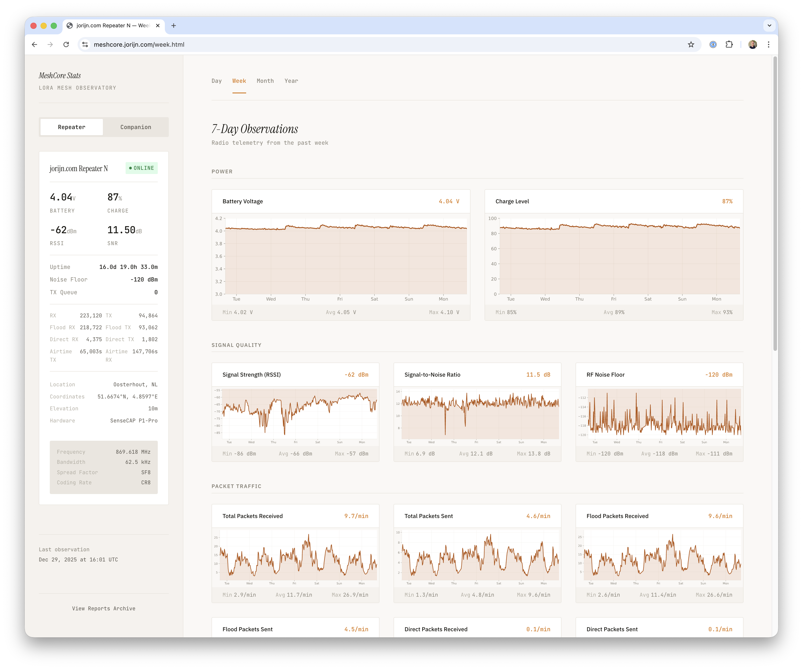
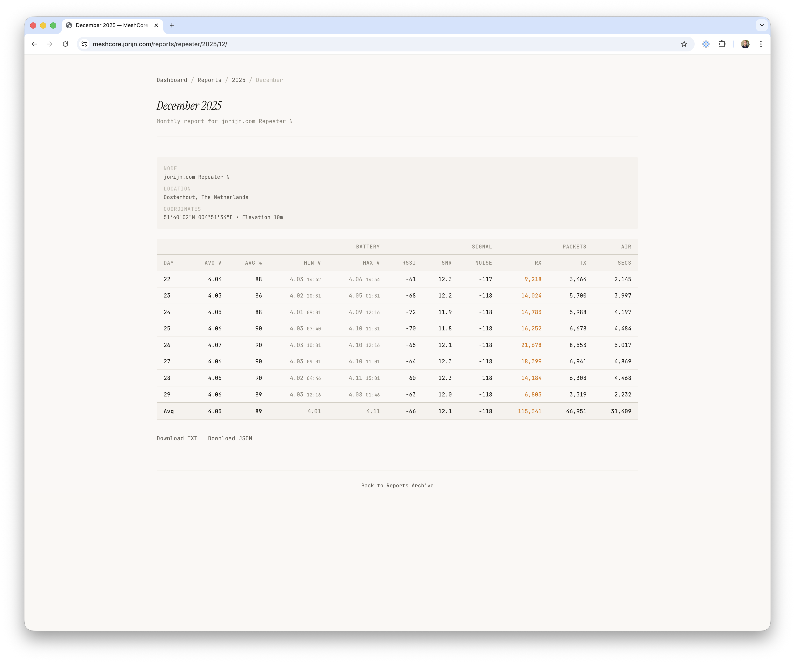

# MeshCore Stats

A monitoring system for MeshCore LoRa mesh networks. Collects metrics from companion and repeater nodes, stores them in SQLite, and generates a static dashboard with interactive charts.

**Live demo:** [meshcore.jorijn.com](https://meshcore.jorijn.com)

<p>
  
  
</p>

## Quick Start

> **Linux only** - macOS and Windows users see [Platform Notes](#platform-notes) first.

```bash
# Clone and configure
git clone https://github.com/jorijn/meshcore-stats.git
cd meshcore-stats
cp meshcore.conf.example meshcore.conf
# Edit meshcore.conf with your repeater name and password

# Create data directories (container runs as UID 1000)
mkdir -p data/state out
sudo chown -R 1000:1000 data out

# Add your serial device
cat > docker-compose.override.yml << 'EOF'
services:
  meshcore-stats:
    devices:
      - /dev/ttyACM0:/dev/ttyACM0
EOF

# Start
docker compose up -d

# Verify it's working. The various collection and render jobs will trigger after a few minutes.
docker compose ps
docker compose logs meshcore-stats | head -20

# View dashboard at http://localhost:8080
```

## Features

- **Data Collection** - Metrics from local companion and remote repeater nodes
- **Interactive Charts** - SVG charts with day/week/month/year views and tooltips
- **Statistics Reports** - Monthly and yearly report generation
- **Light/Dark Theme** - Automatic theme switching based on system preference

## Prerequisites

- Docker and Docker Compose V2
- MeshCore companion node connected via USB serial
- Remote repeater node reachable via LoRa from the companion

**Resource requirements:** ~100MB memory, ~100MB disk per year of data.

## Installation

### Docker (Recommended)

#### 1. Clone the Repository

```bash
git clone https://github.com/jorijn/meshcore-stats.git
cd meshcore-stats
```

#### 2. Configure

Copy the example configuration and edit it:

```bash
cp meshcore.conf.example meshcore.conf
```

**Minimal required settings:**

```ini
# Repeater identity (required)
REPEATER_NAME=Your Repeater Name
REPEATER_PASSWORD=your-admin-password

# Display names
REPEATER_DISPLAY_NAME=My Repeater
COMPANION_DISPLAY_NAME=My Companion
```

See [meshcore.conf.example](meshcore.conf.example) for all available options.

#### 3. Create Data Directories

```bash
mkdir -p data/state out
sudo chown -R 1000:1000 data out
```

The container runs as UID 1000, so directories must be writable by this user. If `sudo` is not available, you can relaxed the permissions using `chmod 777 data out`, but this is less secure.

#### 4. Configure Serial Device

Create `docker-compose.override.yml` to specify your serial device:

```yaml
services:
  meshcore-stats:
    devices:
      - /dev/ttyACM0:/dev/ttyACM0
```

Ensure your user has serial port access:

```bash
sudo usermod -aG dialout $USER
# Log out and back in for changes to take effect
```

#### 5. Start the Containers

```bash
docker compose up -d
```

After the various collection and render jobs has run, the dashboard will be available at **http://localhost:8080**.

#### Verify Installation

```bash
# Check container status
docker compose ps

# View logs
docker compose logs -f meshcore-stats
```

### Common Docker Commands

```bash
# View real-time logs
docker compose logs -f meshcore-stats

# Restart after configuration changes
docker compose restart meshcore-stats

# Update to latest version (database migrations are automatic)
docker compose pull && docker compose up -d

# Stop all containers
docker compose down

# Backup database
cp data/state/metrics.db data/state/metrics.db.backup
```

> **Note**: `docker compose down` preserves your data. Use `docker compose down -v` only if you want to delete everything.

### Manual Installation (Alternative)

For environments where Docker is not available.

#### Requirements

- Python 3.10+
- SQLite3
- [uv](https://github.com/astral-sh/uv)

#### Setup

```bash
cd meshcore-stats
uv venv
source .venv/bin/activate
uv sync
cp meshcore.conf.example meshcore.conf
# Edit meshcore.conf with your settings
```

#### Cron Setup

Add to your crontab (`crontab -e`):

```cron
MESHCORE=/path/to/meshcore-stats

# Companion: every minute
* * * * * cd $MESHCORE && .venv/bin/python scripts/collect_companion.py

# Repeater: every 15 minutes
1,16,31,46 * * * * cd $MESHCORE && .venv/bin/python scripts/collect_repeater.py

# Charts: every 5 minutes
*/5 * * * * cd $MESHCORE && .venv/bin/python scripts/render_charts.py

# Site: every 5 minutes
*/5 * * * * cd $MESHCORE && .venv/bin/python scripts/render_site.py

# Reports: daily at midnight
0 0 * * * cd $MESHCORE && .venv/bin/python scripts/render_reports.py
```

Serve the `out/` directory with any web server.

## Platform Notes

<details>
<summary><strong>Linux</strong></summary>

Docker can access USB serial devices directly. Add your device to `docker-compose.override.yml`:

```yaml
services:
  meshcore-stats:
    devices:
      - /dev/ttyACM0:/dev/ttyACM0
```

Common device paths:
- `/dev/ttyACM0` - Arduino/native USB
- `/dev/ttyUSB0` - USB-to-serial adapters

</details>

<details>
<summary><strong>macOS</strong></summary>

Docker Desktop for macOS runs in a Linux VM and **cannot directly access USB serial devices**.

**Option 1: TCP Bridge (Recommended)**

Expose the serial port over TCP using socat:

```bash
# Install socat
brew install socat

# Bridge serial to TCP (run in background)
socat TCP-LISTEN:5000,fork,reuseaddr OPEN:/dev/cu.usbserial-0001,rawer,nonblock,ispeed=115200,ospeed=115200
```

Configure in `meshcore.conf`:

```ini
MESH_TRANSPORT=tcp
MESH_TCP_HOST=host.docker.internal
MESH_TCP_PORT=5000
```

**Option 2: Native Installation**

Use the manual installation method with cron instead of Docker.

</details>

<details>
<summary><strong>Windows (WSL2)</strong></summary>

WSL2 and Docker Desktop for Windows cannot directly access COM ports.

Use the TCP bridge approach (similar to macOS) or native installation.

</details>

## Configuration Reference

| Variable | Default | Description |
|----------|---------|-------------|
| **Repeater Identity** | | |
| `REPEATER_NAME` | *required* | Advertised name to find in contacts |
| `REPEATER_PASSWORD` | *required* | Admin password for repeater |
| `REPEATER_KEY_PREFIX` | - | Alternative to `REPEATER_NAME`: hex prefix of public key |
| **Connection** | | |
| `MESH_TRANSPORT` | serial | Transport type: `serial`, `tcp`, or `ble` |
| `MESH_SERIAL_PORT` | auto | Serial port path |
| `MESH_TCP_HOST` | localhost | TCP host (for TCP transport) |
| `MESH_TCP_PORT` | 5000 | TCP port (for TCP transport) |
| **Display** | | |
| `REPEATER_DISPLAY_NAME` | Repeater Node | Name shown in UI |
| `COMPANION_DISPLAY_NAME` | Companion Node | Name shown in UI |
| `REPEATER_HARDWARE` | LoRa Repeater | Hardware model for sidebar |
| `COMPANION_HARDWARE` | LoRa Node | Hardware model for sidebar |
| **Location** | | |
| `REPORT_LOCATION_NAME` | Your Location | Full location for reports |
| `REPORT_LAT` | 0.0 | Latitude |
| `REPORT_LON` | 0.0 | Longitude |
| `REPORT_ELEV` | 0.0 | Elevation |
| **Radio** (display only) | | |
| `RADIO_FREQUENCY` | 869.618 MHz | Frequency shown in sidebar |
| `RADIO_BANDWIDTH` | 62.5 kHz | Bandwidth |
| `RADIO_SPREAD_FACTOR` | SF8 | Spread factor |

See [meshcore.conf.example](meshcore.conf.example) for all options with regional radio presets.

## Troubleshooting

| Symptom | Cause | Solution |
|---------|-------|----------|
| "Permission denied" on serial port | User not in dialout group | `sudo usermod -aG dialout $USER` then re-login |
| Repeater shows "offline" status | No data or circuit breaker tripped | Check logs; delete `data/state/repeater_circuit.json` to reset |
| Empty charts | Not enough data collected | Wait for 2+ collection cycles |
| Container exits immediately | Missing or invalid configuration | Verify `meshcore.conf` exists and has required values |
| "No serial ports found" | Device not connected/detected | Check `ls /dev/tty*` and device permissions |
| Device path changed after reboot | USB enumeration order changed | Update path in `docker-compose.override.yml` or use udev rules |
| "database is locked" errors | Maintenance script running | Wait for completion; check if VACUUM is running |

### Debug Logging

```bash
# Enable debug mode in meshcore.conf
MESH_DEBUG=1

# View detailed logs
docker compose logs -f meshcore-stats
```

### Circuit Breaker

The repeater collector uses a circuit breaker to avoid spamming LoRa when the repeater is unreachable. After multiple failures, it enters a cooldown period (default: 1 hour).

To reset manually:

```bash
rm data/state/repeater_circuit.json
docker compose restart meshcore-stats
```

## Architecture

```
┌─────────────────┐     LoRa      ┌─────────────────┐
│   Companion     │◄─────────────►│    Repeater     │
│  (USB Serial)   │               │   (Remote)      │
└────────┬────────┘               └─────────────────┘
         │
         │ Serial/TCP
         ▼
┌─────────────────┐
│   Docker Host   │
│  ┌───────────┐  │
│  │ meshcore- │  │     ┌─────────┐
│  │   stats   │──┼────►│  nginx  │──► :8080
│  └───────────┘  │     └─────────┘
│        │        │
│        ▼        │
│   SQLite + SVG  │
└─────────────────┘
```

The system runs two containers:
- **meshcore-stats**: Collects data on schedule (Ofelia) and generates charts
- **nginx**: Serves the static dashboard

## Documentation

- [docs/firmware-responses.md](docs/firmware-responses.md) - MeshCore firmware response formats

## License

MIT

## Public Instances

Public MeshCore Stats installations. Want to add yours? [Open a pull request](https://github.com/jorijn/meshcore-stats/pulls)!

| URL | Hardware | Location |
|-----|----------|----------|
| [meshcore.jorijn.com](https://meshcore.jorijn.com) | SenseCAP Solar Node P1 Pro + 6.5dBi Mikrotik antenna | Oosterhout, The Netherlands |
